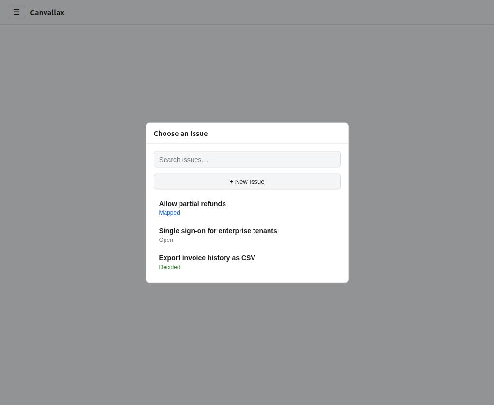
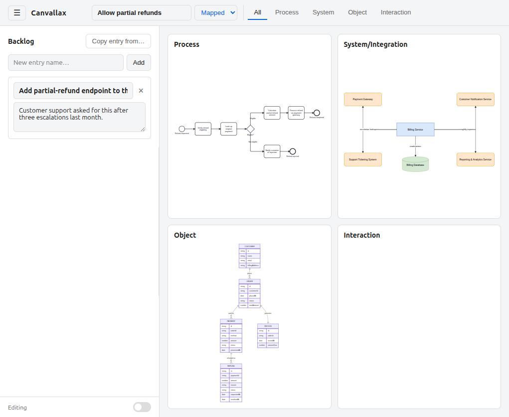
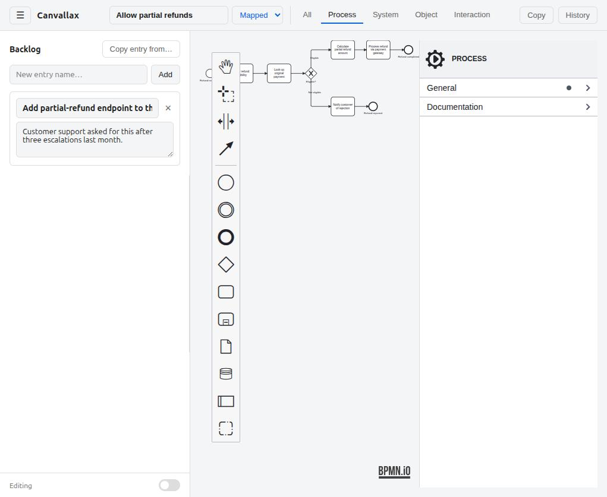
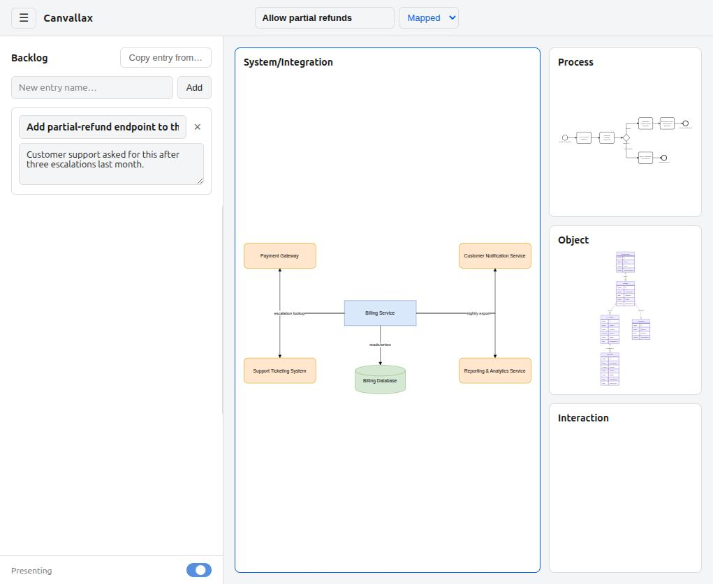

# Canvallax

**Canvases lead to alignment of mind states by shifting from parallax to parallel understanding.**

Canvallax is a webapp for remote teams that need business and technical stakeholders to understand the same system the same way.
It gives a team a small set of shared, deliberately incomplete visual canvases, so that planning and prioritization decisions are made from a common ground.


## Screenshots

| | |
|---|---|
|  *Choosing an Issue* |  *All four canvases at a glance* |
|  *The Process canvas, editing* |  *Presenting mode: one canvas enlarged, the rest stacked beside it* |


## Running Locally

```
npm install
npm run dev      # starts the Vite dev server, http://localhost:5173/
npm run build    # production build to dist/
npm run preview  # serve that build locally
```

Requires Node.js (any current LTS).


## Naming

**Canvallax** blends *canvas*, *parallax*, *parallel*, and *align* — chosen to name the exact mechanic at the core of the product:

- **Canvas** — the shared surface each stakeholder actually works on: a small, deliberately incomplete visual artifact, not a formal specification.
- **Parallax** — in optics and astronomy, parallax is the apparent shift of an object depending on the position from which you view it: the same star looks like it's in a different spot when observed from opposite sides of the earth's orbit. That's exactly what happens to a software system when different roles look at it: the same backlog item looks different depending on whether you view it as a *process*, an *object/data structure*, an *integration point*, or a *user interaction*. No single view is "the truth" — each is a partial, honest projection of the same underlying system, and the gaps between them are exactly where risk and misunderstanding hide.
- **Parallel** — a remote, screen-based tool can put these projections genuinely side by side instead of forcing people to look at one thing at a time. Canvallax leans into that: multiple canvases open in parallel, so a team can flip between projections of the same item without losing context.
- **Align** — the whole point of comparing parallax views is to triangulate a shared, agreed position. Canvallax names that convergence directly: the product's job isn't just to *show* different perspectives, it's to help a distributed team *align* on what they add up to.

Put together: **Canvases lead to alignment of mind states by shifting from parallax to parallel understanding.**


## The Core: Canvases

A Canvallax **Issue** is built around a small number of **canvases**, each dedicated to one deliberately narrow perspective on the system, plus a **Backlog** list. Every canvas stays intentionally incomplete: it is not a formal specification, but an orientation device — just enough structure to anchor a conversation and reveal what a single stakeholder group would otherwise miss. All of an Issue's canvases live together and can be viewed side by side (the "parallel view") or one at a time in full-screen — see `agents.md` for how the shell ties them together.

- **Backlog**
  The entry point of the project. Holds prioritized, concrete needed changes as short entries — a name and a free-text description — scoped to one Issue. As an Issue gets analyzed on the other canvases and decisions get made, its own status tracks that progress (open → mapped → decided), so it doubles as the interface between "people doing the analysis" and "people making the call."

- **Process Canvas**
  Shows the *sequence of business activities* needed to fulfill a backlog item: the steps, the alternative and concurrent paths through them, and the conditions/constraints that route between them. This is the "what has to happen, in what order" view. It stays at a business-activity level of abstraction — implementation steps and technical sequencing belong elsewhere.

- **Object Canvas**
  Shows the *data the process operates on*: the business entities involved (e.g. "customer," "contract," "claim") and the relationships between them, kept at a business level of abstraction. Implementation detail — how entities are actually composed, stored, or indexed — is deliberately left off; the point is to agree on *what things exist and how they relate*, not to pre-decide a schema.

- **System/Integration Canvas**
  Shows how the system under discussion *talks to everything outside it*: other systems and services, and the data or protocols exchanged at each incoming/outgoing interface. This is where dependency risk and coordination requirements with other teams or external parties become visible early, instead of surfacing mid-implementation.

- **Interaction Canvas**
  Shows how a *person* experiences the system: a navigation overview of menu structure and dialog flow, plus rough storyboard-level sketches of the actual screens where useful. This is the canvas that keeps the other three grounded in what an end user actually does and sees.

Together, these four canvases plus the Backlog cover the same questions any nontrivial backlog item raises — *what has to happen, what data is involved, what it depends on outside itself, how a person uses it, and what's actually left to do* — without requiring anyone to produce, or read, a complete formal specification to answer them. They're grouped by Issue, not linked element-to-element — see `docs/adr/0009-no-cross-canvas-linking.md` for why.
